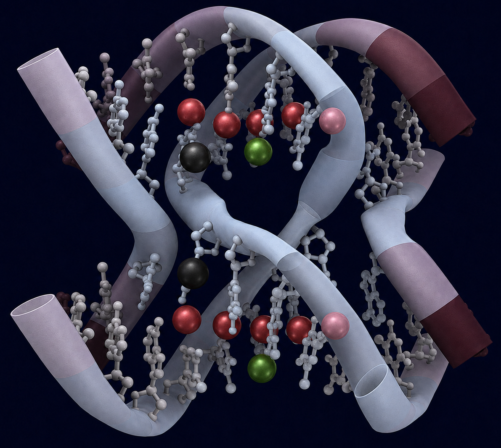
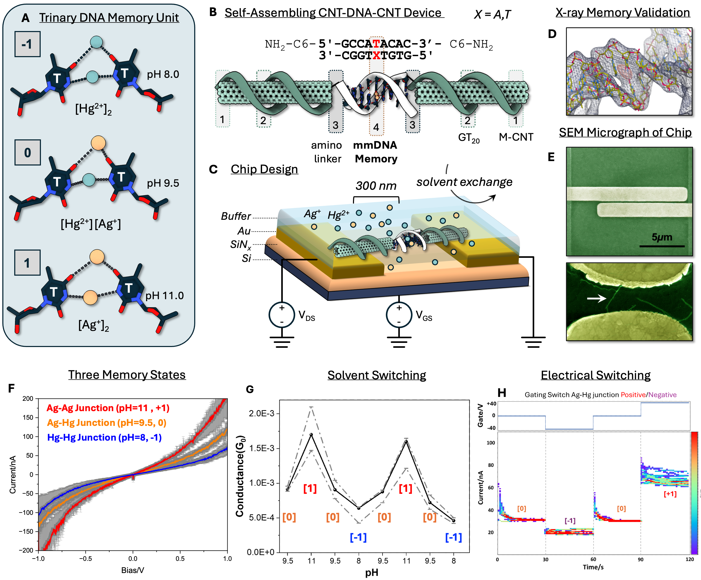
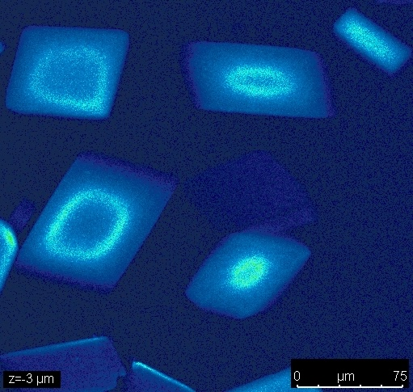
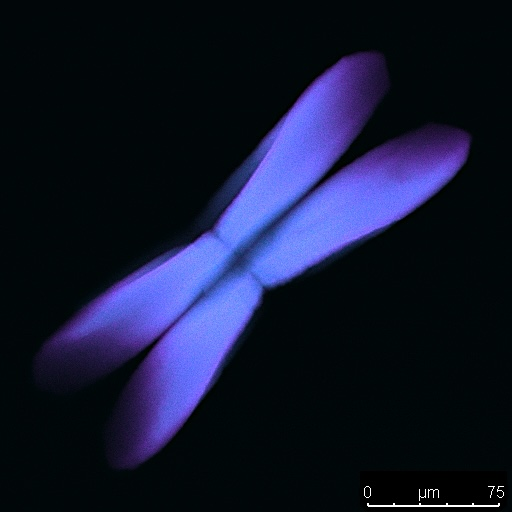
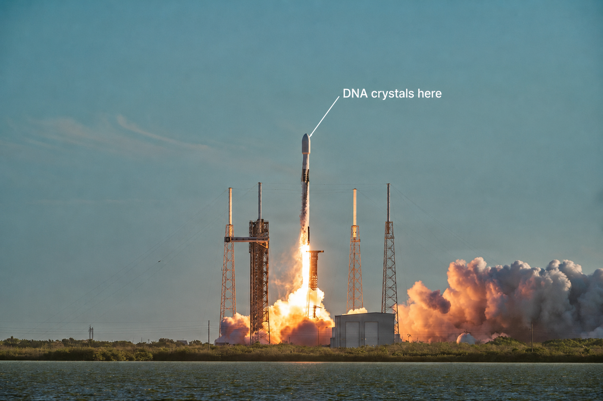
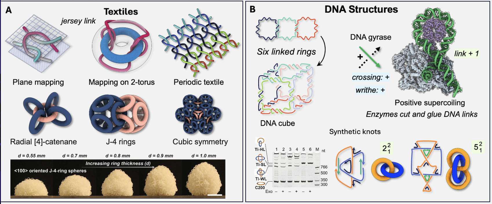

::: {.concept-hero}

::: {.hero-content}

IMPERIAL COLLEGE LONDON · DEPARTMENT OF LIFE SCIENCES

# Programming active matter using DNA

We engineer nucleic acids into functional materials with bespoke electronic, photonic and quantum properties. 

[Explore our research →](research/index.qmd){.hero-button}
:::
:::

::: {.research-opening}

OUR RESEARCH

## Remodeling the double helix atom by atom
:::

::: {.research-panel .research-panel-vision}

::: {.research-panel-text}

00

## A Metal Design Language

The overarching theme of the DNA Lab is to develop a bioinorganic programming language in which topological self-assembly of nucleic acids is carried out using metal base pairs. By replacing select hydrogen bonds with metal coordination bonds, we aim to expand the intrinsic functionality of nucleic acids to interface with light, electrons, and biochemical inputs.

Using high-throughput X-ray crystallography, iterative design, and collaboration with chemists and physicists, we aim to make complex molecules, such as the 3D tile shown here, possible in the near future.

[Explore this research →](research/metal-design-language/index.qmd){.panel-link}

:::

::: {.research-panel-image}

Metal-mediated nucleic-acid tile. As a goal, we show a double-crossover motif with nearly full metalation at the center of the double helix.
<a href="https://doi.org/10.1002/adma.202210938">Vecchioni et al, Advanced Materials (2023) 35, 2210938</a>

:::

:::

::: {.research-panel}

::: {.research-panel-text}

01

## Molecular Electronics and Quantum Materials

We leverage the extreme precision of the double helix to engineer technologies around atomic parts. This mission has led to the development of the first DNA transistor, storing electrical information in DNA for the first time using a two-atom switch.

Our current projects expand into circuit design and quantum devices that leverage metallic DNA hybrids.

[Explore this research →](research/molecular-electronics/index.qmd){.panel-link}

:::

::: {.research-panel-image}

The first DNA transistor, which stored three memory states based on reversible metal coordination with field-driven reconfiguration. 
<a href="https://doi.org/10.1016/j.matt.2025.102470">Liu et al, Matter (2026) 9,1, 102470. </a>

:::

:::

::: {.research-panel}

::: {.research-panel-text}

02

## Nanophotonics in DNA

We employ a combination of molecular and metallic fluorophores to engineer tunable interactions between light and matter. The key advance is the use of topological enforcement from 3D DNA tiles in order to control templated metalation and fluorophore interactions, allowing for spatial control over molecular lightbulbs.

[Explore this research →](research/nanophotonics/index.qmd){.panel-link}

:::

::: {.research-panel-image}

Silver nanoclusters are formed in situ to generate novel optical materials.
<a href="https://doi.org/10.26434/chemrxiv-2025-3f6br-v2">Perren et al., Science Advances (2026), in press.</a>

:::

:::

::: {.research-panel}

::: {.research-panel-text}

03

## (A)Biomorphogenesis

 We further develop shape-encoded architectures, in which we harness the entropic nature of self-assembly to dive complex organization of DNA components at long range. In
doing so, we will establish information thresholds and design rules for differentiation and morphogenesis.

[Explore this research →](research/abiomorphogenesis/index.qmd){.panel-link}

:::

::: {.research-panel-image}

Here we show a union of mirror image tiles, L- and D-DNA, programmed to interact and form an ordered lattice or controlled shape using tunable stacking interactions.
<a href="https://doi.org/10.1038/s41467-026-69973-1">Woloszyn et al., Nature Communications (2026), 17, 3136.</a>

:::

:::

::: {.research-panel}

::: {.research-panel-text}

04

## Origins of Life and Astrobiology

Our work began as a summer internship at NASA when Simon proposed an E. coli radio <a href="https://2013.igem.org/Team:Stanford-Brown/Projects/BioWires"> (2013 Stanford-Brown iGEM)</a>. Since then, NASA participation has been deeply embedded in the work, and we now explore DNA as a viable space technology. We further explore the role that metalated nucleic acids had in the devleopment of early life on Earth, and ultimately enabling human space exploration.

[Explore this research →](research/origins-of-life/index.qmd){.panel-link}

:::

::: {.research-panel-image}

Metalated DNA crystals launched aboard SpaceX NG-24 for long-term stability test on ISS, 11 April, 2026 
<a href="https://www.dvidshub.net/image/9617831/cygnus-ng-24-launches-cape-canaveral-space-force-station"> U.S. Space Force / DVIDS</a>

:::

:::

::: {.research-panel}

::: {.research-panel-text}

05

## Building Community

We build tools, databases, shared resources, and scientific communities that make nucleic-acid materials research more accessible, reproducible, and collaborative.

We emphasize writing thorough, accessible reviews for new students, written by curious humans, for curious humans; developing software tools for understanding and analyzing DNA crystals; building databases to house and disseminate the field; and establishing an inclusive, open, and kind scientific community where creativity and curiosity dominate the scientific process.

[Explore our community and mission →](research/building-community/index.qmd){.panel-link}

:::

::: {.research-panel-image}

Review of realsapce and reciprocal space topology was written to unify concepts in disparate fields to spark dialogue and explore DNA as a materials design language in both spaces.
<a href="https://doi.org/10.26434/chemrxiv-2025-swzkq"> Vecchioni et al, ChemRxiv (2025)</a>

:::

:::