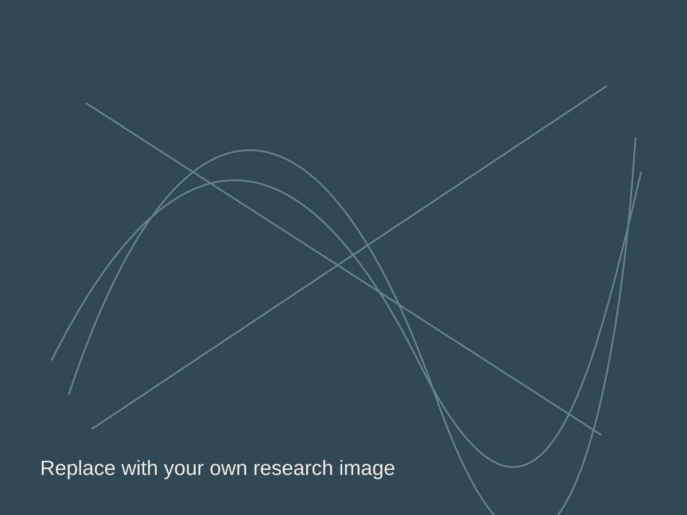

::: {.hero}
::: {.hero-copy}

VECCHIONI LAB · IMPERIAL COLLEGE LONDON

# Programming matter with DNA

We engineer nucleic acids into crystalline, topological, electronic, and inorganic materials.

[Explore our research](research/index.qmd){.button-primary}
:::

::: {.hero-art}

:::
:::

## Research

::: {.research-grid}
::: {.research-card}
### DNA crystal engineering

Designing periodic nucleic-acid frameworks with programmable structure and function.

[Explore](research/dna-crystals/index.qmd)
:::

::: {.research-card}
### Metal-mediated nucleic acids

Using coordination chemistry to control nucleic-acid structure, reactivity, and electronics.

[Explore](research/metal-mediated-nucleic-acids/index.qmd)
:::

::: {.research-card}
### Programmable materials

Translating molecular information into inorganic and hybrid material architectures.

[Explore](research/programmable-materials/index.qmd)
:::

::: {.research-card}
### Origins and catalysis

Investigating early metal–nucleic-acid interactions and emergent catalytic function.

[Explore](research/origins-and-catalysis/index.qmd)
:::
:::

::: {.split-section}
::: {.split-copy}
## Science first

The website is deliberately restrained: your own structures, figures, micrographs, and experimental images supply the visual identity.
:::

::: {.split-copy}
## Built to change

Research titles, summaries, page order, and imagery are stored in page metadata, so the scientific content can evolve without rebuilding the layout.
:::
:::
