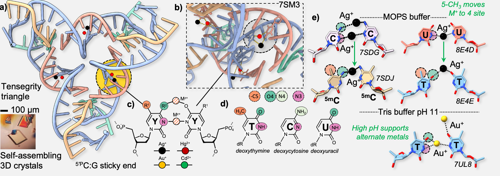
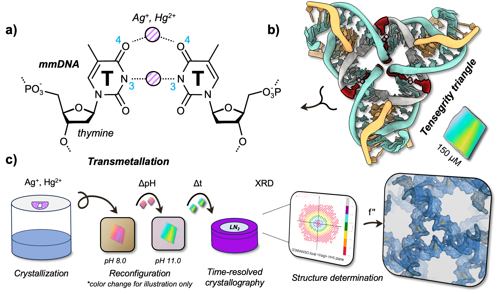

::: {.research-page-hero}

# A Metal Design Language

We develop a bioinorganic programming language in which metal coordination is used to encode structure, function, and information into nucleic acids.

:::

::: {.research-page-image}

Workflow of developing metal-mediated DNA chemistry using self-assembling crystals.
<a href="https://doi.org/10.1021/jacs.3c05478">Lu et al, JACS (2023) 145 (32), 17945–17953.</a>

:::

## Overview

The DNA molecule is the foundation for “semantomorphic” science, where the information
contained within a nucleobase sequence (semanto-) is exploited for the topological
programming of 2D and 3D architectures (-morphic). This is driven by Watson-Crick parity,
the non-symmetric base complementarity between orthogonal nucleotide pairs (A:T, C:G).
Metal Base Pairs: The intrinsic functionality of DNA enables self-assembly of branched structures
(DNA origami, 3D crystals, etc.), but there is little in the way of electronic, magnetic, or photonic capacity
from native DNA. It was found in 2006 that natural T:T mismatches could selectively bind Hg2+ ions in
what is known as a metal-mediated DNA base pair (mmDNA), but to date no real applications of this
technology have been engineered. The main roadblock to this technology lies in programming—a DNA
alphabet in which each letter binds the same metals inhibits any ability to carry out self-assembly.

Thus a grand challenge in the field of DNA metalation is orthogonality: (1) there should exist at least
two non-equivalent metal base pairs (C:G vs. A:T); (2) and those base pairs should be asymmetric
(A:T/T:A). My research program will establish a means of topological programming of single metal
ions in 3D architectures using the rapid crystallographic screening of orthogonal metal base pairs.

## Research Workflow

### Metal-mediated base pairing

We first use self-assembling crystals (i.e. the tensegrity triangle) as a high-throughput diffraciton platform to screen novel metalated DNA interactions. Using structural biology tools, we build a structural database that can be used for design, iteration, and experimentation.

### Responsive Coordination

Once molecular structures are resolved, we work to identify the criteria for metalation: pH, buffer, co-metalation, etc. We then find ways to dynamically perturb these pairs, yielding techniological outputs.

::: {.research-page-image .secondary-image}

Reconfigurable metalation using DNA crystallography.
<a href="https://doi.org/10.1002/smll.202411518">De et al, Small (2026) 21, 2411518.</a>

:::

### Language development

Finally, we aim to develop a coding language that reads metals as an input to store information. We further aim to expand the library of metals inside the double helix to enable new functions.

## Selected work from the lab:

  Toomey, E., Xu, J., Vecchioni, S., et al.
  
    J. Phys. Chem. C · <strong>2016</strong> · 120(14)
  
  Comparison of Canonical vs Silver(I)-Mediated Base-Pairing on Single Molecule Conductance in Polycytosine dsDNA.

  Vecchioni, S., Wind, S.J.
  
    US Patent US20170294608A1 · <strong>2017</strong>
  
  Self-assembled, electronically-functional nucleic acid nanostructures and networks based on the use of orthogonal base pairs.

  Vecchioni, S. et al.
  
    J. Self-Assembly and Molecular Electronics · <strong>2018</strong> · 6 · 61
  
  Methods of Synthesis and Characterization of Conductive DNA Nanowires for Single-Molecule Electronics.

  Vecchioni, S. et al.
  
    Scientific Reports · <strong>2019</strong> · 9(1)
  
  Construction and characterization of metal ion-containing DNA nanowires for synthetic biology and nanotechnology.

  Vecchioni, S. et al.
  
    J. Self-Assembly and Molecular Electronics · <strong>2023</strong> · 17–76
  
  DNA by Design: De novo computational framework for DNA sequence design and nanotechnology.

  Vecchioni, S.*†, Lu, B.*, …, Sha, R.†
  
    Advanced Materials · <strong>2023</strong> · 35 · 2210938
  
  Metal-Mediated DNA Nanotechnology in 3D: Structural Library by Templated Diffraction.

  Lu, B., … Canary, J.W., Sha, R., Vecchioni, S.†
  
    JACS · <strong>2023</strong> · 145(32)
  
  Heterobimetallic Base Pair Programming in Designer 3D DNA Crystals.

  Vecchioni, S.† et al.
  
    Small · <strong>2024</strong> · 21(3) · 2407604
  
  Silver(I)-Mediated 2D DNA Nanostructures.

  Vecchioni, S.*, Ohayon, Y.P.*, Hoshika, S., Benner, S.A., Sha, R.
  
    Nano Letters · <strong>2024</strong> · 24(45)
  
  Six-Letter DNA Nanotechnology: Incorporation of Z-P Base Pairs into Self-Assembling 3D Crystals.

  De, A., … Anantram, M.P.†, Vecchioni, S.†
  
    Small · <strong>2025</strong> · 21(25) · 2411518
  
  Transmetalation for DNA-based Molecular Electronics.

  Liu, B., Lu, B., … Vecchioni, S.†, Hihath, J.†
  
    Matter · <strong>2025</strong> · 102470
  
  Electrical Control of a Metal-Mediated DNA Memory.

