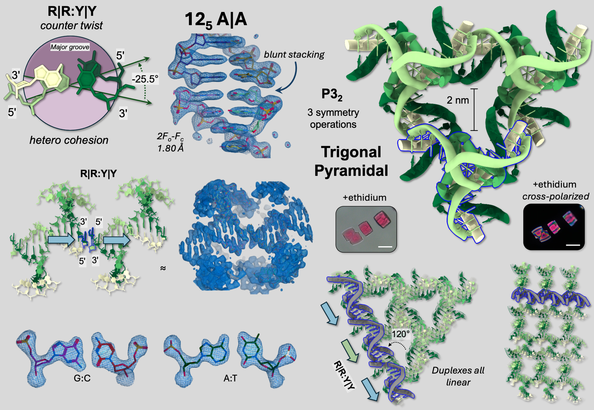
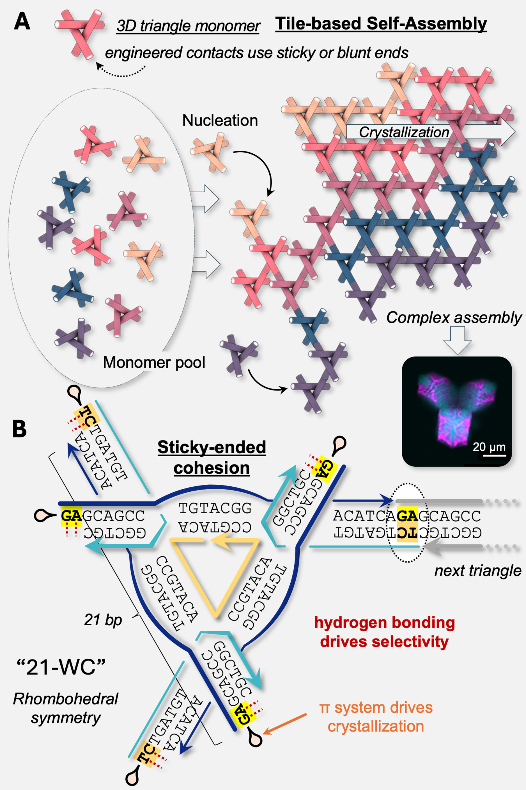

::: {.research-page-hero}

DNA TOPOLOGY

# Encoding shape || Encoding with shape

We engineer self-assembling DNA crystals to discover and develop topological motifs and materials from nucleic acids. We then employ those functional motifs to propagate information at scale.

:::

::: {.research-page-image}

Topological self-assembly using interfacial interactions. Here stacking geometry and tile design yielded the first (nearly) rationally-designed tile that diffracts at better resolution than 2 Å.
<a href="https://doi.org/10.1038/s41467-026-69973-1">Woloszyn et al., Nature Communications (2026), 17, 3136.</a>

:::

## Overview

With origins in the lab of the late Ned Seeman at NYU, structural DNA nanotechnology employs rigid, branched DNA objects -- tiles -- to programmably tessellate into 3D matter. The original motifs were accidental, recovered from early entries in the Protein Databank (PDB) and unknown to the field at large. The first rationally-designed 3D DNA crystal was developed by Chengde Mao and Ned Seeman, published in Nature in 2009. This tile, the tensegrity triangle, represented both the first and one of the last examples of a bottom-up, rationally-designed motif. Since that time, iterative changes to working designs, coupled with high-throughput screening have yielded a vast array of new motifs (see reviews and selected publications below).

The founding ideology was to use self-assembled crystals to solve the biomolecular structure of guest proteins. The key feature of Ned's lattices was their porous nature--consisting of >90% water, they can be packed to the gills with guest molecules. This also proved a fundamental challenge in diffraction, yielding low resolutions that precluded good structural characterizations.

Recent breakthroughs at NYU and in the field have enabled atomic-level detail from self-assembled crystals, re-invigorating the structural search for motifs, guests, and applications.

## Topological Design in the Lab

In the Lab, we engage in iterative design and screening to develop new motifs, both predicted and unknown. Our members will learn the tools of molecular design and analysis, and thereby engage in the discovery of new materials.

While Simon was at NYU, he and the team discovered rules about heirarchical chirality, reconfigurable lattices, and augmented, asymmetric cavities. At Imperial, the lab will seek to add to this material design language, and to form deep connections with metalation and materials science applications.

::: {.research-page-image .secondary-image}

Tile-based self-assembly using sticky-ended triangle motifs.
<a href="https://doi.org/10.1038/s41467-026-69973-1">Woloszyn et al., Nature Communications (2026), 17, 3136.</a>

:::

## Data Curation

All motifs developed are likely to diffract x-rays, enabling deposition in the PDB (250+ examples and counting). Part of our work involves building a new structural database that can understand and predict the underlying topology of these materials, and to mine the PDB for "lost" entries.

## Shape Encoding

New motifs will necessarily possess geometric and topological interfaces that can be exploited for information transfer during the self-assembly process. We will exploit these differences in shape and molecular decision making to design morphogenic materials at scale.

## Select publications

Woloszyn, K.*, Horvath, A.*, Jaffe, M., Perren, L., Rueb, J., Mahiba, S., Jonoska, N., Ohayon, Y.P., Canary, J.W., Vecchioni, S.†, Sha, R.†
Nature Communications · <strong><a href="https://www.nature.com/articles/s41467-026-69973-1">2026</a></strong> · 17, 3136
Blunt-Force Assembly of Programmable DNA Architectures using π–π Stacking

Janowski, J.*, Pham, V.A.B.*, Vecchioni, S.*, Woloszyn, K., Lu, B., Zou, Y., Erkalo, B., Perren, L., Rueb, J., Madnick, J., Mao, C., Saito, M., Ohayon, Y.P., Jonoska, N., Sha, R.
PNAS · <strong><a href="https://doi.org/10.1073/pnas.2321992121">2024</a></strong> · 121 (19), e2321992121
Engineering Tertiary Chirality in Helical Biopolymers

Vecchioni, S.†, Sha, R., and Ohayon, Y.P.
DNA Nanotech at 40 for the Next 40 · Springer · <strong><a href="https://doi.org/10.1007/978-981-19-9891-1_1">2023</a></strong>
Beyond Watson-Crick: The Next 40 Years of Semantomorphic Science

Vecchioni, S., Lu, B., Janowski, J., Woloszyn, K., Jonoska, N., Seeman, N.C., Mao, C., Ohayon, Y.P., Sha, R.
Small · <strong><a href="https://doi.org/10.1002/smll.202206511">2023</a></strong> · 19 (12), 2206511
The Rule of Thirds: Controlling Junction Chirality and Polarity in 3D DNA Tiles

Lu, B., Woloszyn, K., Ohayon, Y.P., Yang, B., Zhang, C., Mao, C., Seeman, N.C., Vecchioni, S., Sha, R.
Angewandte Chemie International Edition · <strong><a href="https://doi.org/10.1002/anie.202213451">2023</a></strong> · 62 (6)
Programmable 3D Hexagonal Geometry of DNA Tensegrity Triangles

Lu, B., Vecchioni, S., Ohayon, Y.P., Woloszyn, K., Markus, T., Mao, C., Seeman, N.C., Canary, J.W., Sha, R.
Small · <strong><a href="https://doi.org/10.1002/smll.202205830">2023</a></strong> · 19 (3), 2205830
Highly Symmetric, Self-Assembling 3D DNA Crystals with Cubic and Trigonal Lattices

Woloszyn, K.*, Vecchioni, S.*, Ohayon, Y.P., Lu, B., Ma, Y., Huang, Q., Zhu, E., Chernovolenko, D., Markus, T., Jonoska, N., Mao, C., Seeman, N.C., Sha, R.
Advanced Materials · <strong><a href="https://doi.org/10.1002/adma.202206876">2022</a></strong> · 34 (49), 2206876 · <a href="https://onlinelibrary.wiley.com/doi/10.1002/adma.202270340">Journal Frontpiece</a>
Augmented DNA Nano-Architectures: A Structural Library of 3D Self-Assembling Tensegrity Triangle Variants

Lu, B., Vecchioni, S., Ohayon, Y.P., Canary, J.W., Sha, R.
Biophysical Journal · <strong><a href="https://doi.org/10.1016/j.bpj.2022.08.019">2022</a></strong> · 121 (24) · <a href="https://www.cell.com/biophysj/issue?pii=S0006-3495(21)X0027-6#fullCover">Journal Cover</a>
The Wending Rhombus: Self-Assembling 3D DNA Crystals

Lu, B., Vecchioni, S., Ohayon, Y.P., Sha, R., Woloszyn, K., Yang, B., Mao, C., Seeman, N.C.
ACS Nano · <strong><a href="https://doi.org/10.1021/acsnano.1c06963">2021</a></strong> · 15 (10)
3D Hexagonal Arrangement of DNA Tensegrity Triangles

